# 🍽️ DeliveryBot – Gestión de Pedidos Internos de Cafetería

**Autor:** Gelvez Rodriguez Samuel David
**Repositorio:** [Proyecto_DeliveryBot_GelvezRodriguezSamuelDavid](https://github.com/samuelgelvez-star/Proyecto_DeliveryBot_GelvezRodriguezSamuelDavid.git)
**Google Sheets (Base de Datos):** [DeliveryBot_DB](https://docs.google.com/spreadsheets/d/1BmoQ6RomVbNW-0NgIlpgvV_lynHmP1jeW5SOnNhIWtw/edit?gid=0#gid=0)
**Plataforma:** n8n + Telegram + Google Sheets

---

## 📋 Descripción del Proyecto

DeliveryBot es una solución de automatización basada en **n8n** que convierte a Telegram en una terminal de pedidos inteligente para entornos institucionales como oficinas, universidades o grandes centros de trabajo.

El sistema permite a empleados o estudiantes consultar el menú, armar su carrito de compras y recibir notificaciones en tiempo real sobre el estado de su pedido (Recibido → Preparación → En camino → Entregado), mientras genera automáticamente reportes de ventas para la administración.

---

## 🎯 Objetivos

- Implementar un sistema de pedidos digital mediante una interfaz conversacional en Telegram.
- Automatizar el cálculo de totales y la generación de números de orden únicos.
- Gestionar el ciclo de vida del pedido a través de estados dinámicos.
- Centralizar el inventario y menú en Google Sheets para actualización fácil.
- Generar reportes diarios de ventas automáticamente a las 6pm.
- Optimizar la comunicación entre cocina y cliente mediante notificaciones push.

---

## 🏗️ Arquitectura del Sistema

El sistema está compuesto por **3 bots de Telegram** independientes y **1 flujo de reporte automático**, todos orquestados desde n8n:

```
┌─────────────────────────────────────────────────────────┐
│                     n8n (Orquestador)                   │
│                                                         │
│  📱 DeliveryBot_bot     → Flujo Usuario (UserBot)       │
│  👨‍🍳 CocinaCafeteria_bot → Flujo Cocina (CocinaBot)     │
│  🔐 AdminCocina_bot     → Flujo Admin (AdminBot)        │
│  ⏰ Schedule 6pm        → Reporte Automático Diario     │
│                                                         │
│              ☁️ Google Sheets (Base de Datos)           │
└─────────────────────────────────────────────────────────┘
```

**Total de nodos en el workflow principal:** 98 nodos
**Triggers activos:** 4 (3 Telegram + 1 Schedule)

---

## 🤖 Bots de Telegram

### 📱 @DeliveryBot_bot — Bot de Usuario

Bot principal con el que interactúan los clientes finales.

**Funcionalidades:**
- `/start` — Muestra el menú principal con categorías (Bebidas, Almuerzos, Snacks)
- Navegación por categorías y selección de productos con botones inline
- Carrito de compras con cálculo de totales en tiempo real
- Confirmación de pedido con ID único (`PED-XXXXXX`)
- Notificaciones push de cambio de estado en tiempo real
- Sistema de puntos de lealtad (1 punto por cada $1.000 gastado)
- Historial de pedidos personales

**Capturas de funcionamiento:**

| Menú Principal | Selección de Categoría | Producto Agregado |
|:-:|:-:|:-:|
| 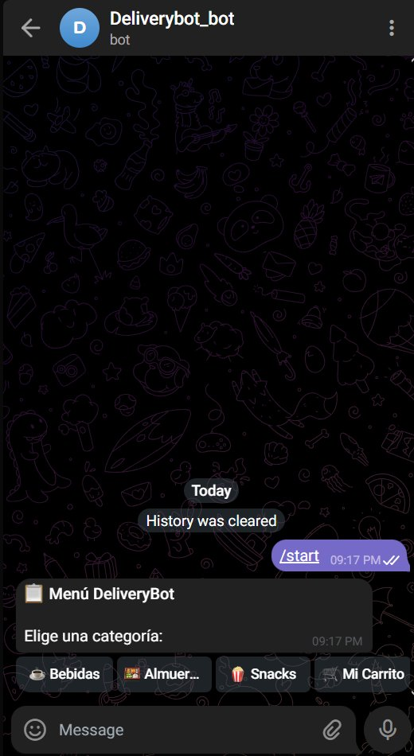 | 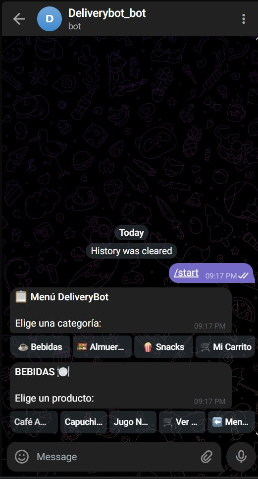 | 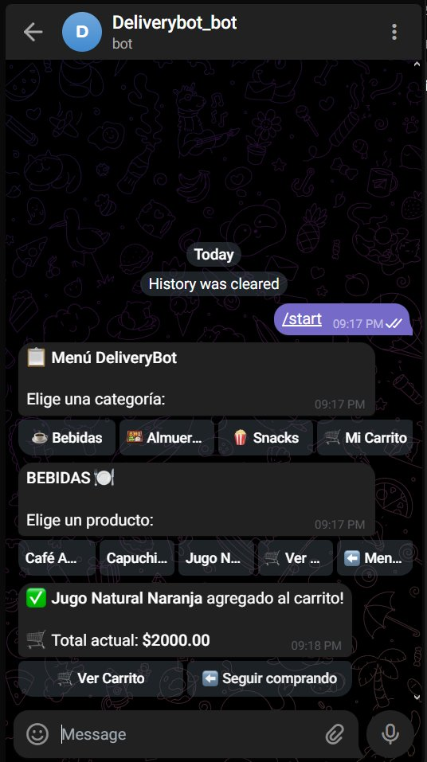 |

| Carrito | Pedido Confirmado + Puntos | Notificación de Estado |
|:-:|:-:|:-:|
| 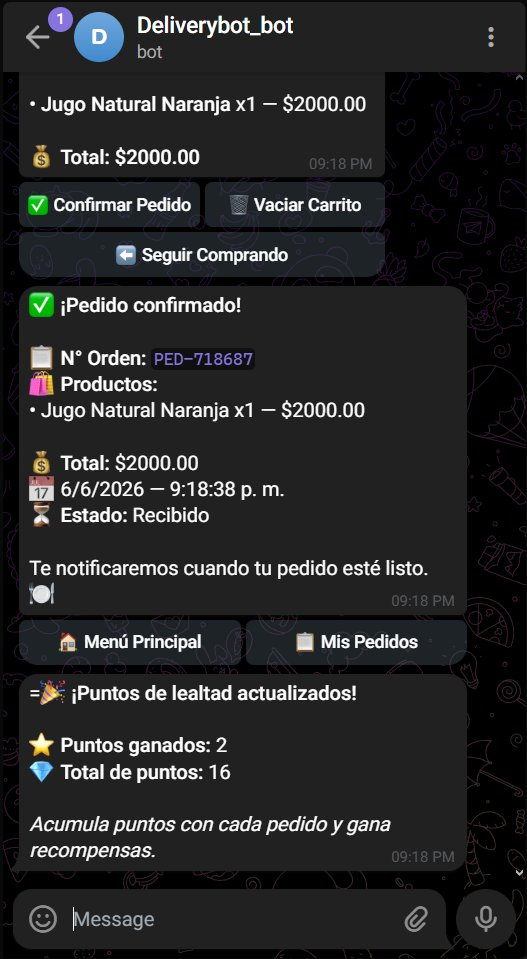 | 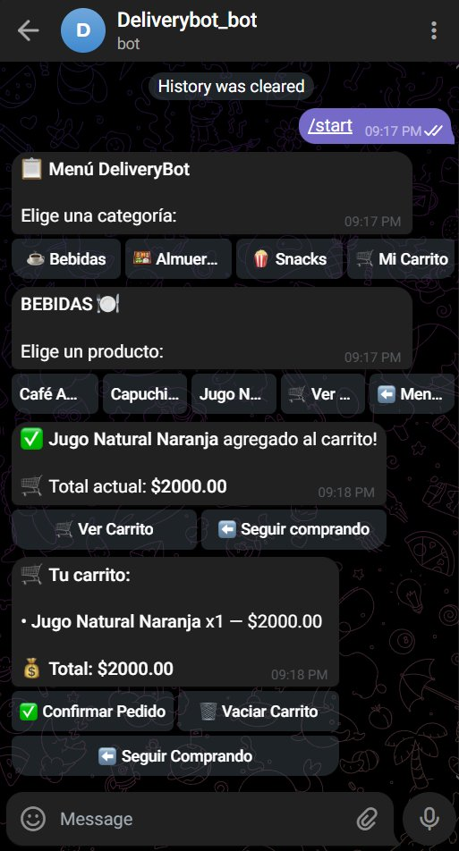 | 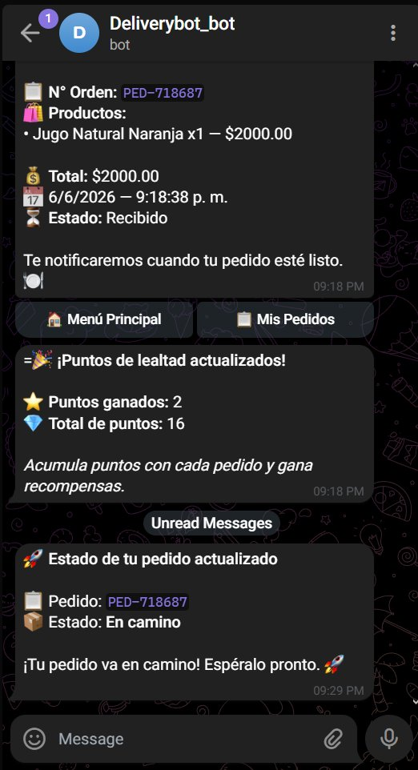 |

---

### 👨‍🍳 @CocinaCafeteria_bot — Bot de Cocina

Panel exclusivo para el personal de cocina. Recibe pedidos entrantes y permite actualizar su estado.

**Comandos disponibles:**
- `ayuda` — Muestra todos los comandos disponibles
- `/pedidos` — Lista los pedidos activos del día
- `/estado [ID_PEDIDO] [estado]` — Actualiza el estado de un pedido

**Estados válidos:** `preparacion` | `en_camino` | `entregado`

**Ejemplo de uso:**
```
/estado PED-718687 En camino
```

Al cambiar el estado, el cliente recibe automáticamente una notificación push en @DeliveryBot_bot.

**Capturas de funcionamiento:**

| Nuevo Pedido Entrante | Cambio de Estado |
|:-:|:-:|
| 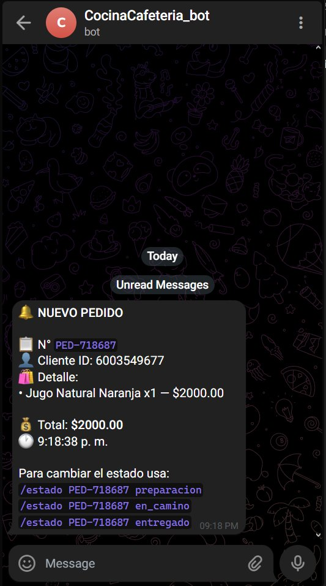 | 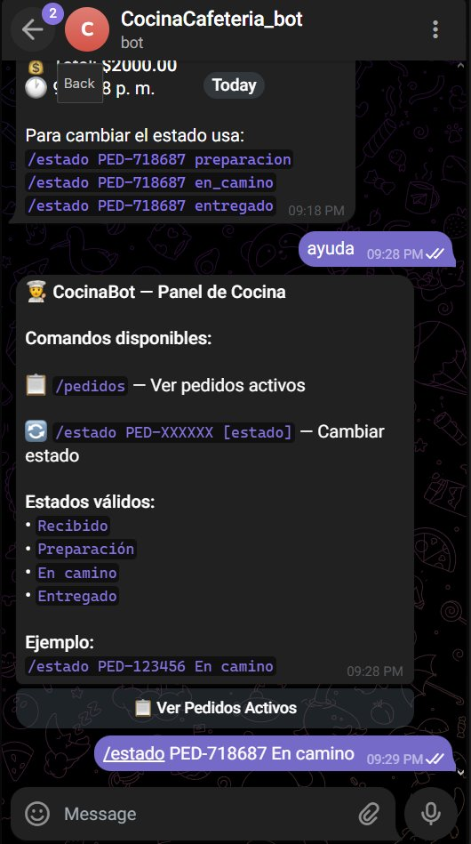 |

---

### 🔐 @AdminCocina_bot — Panel de Administración

Panel de inteligencia de negocio para el administrador.

**Opciones del menú `/start`:**

| Opción | Descripción |
|---|---|
| 📊 Reporte del Día | Total vendido, ticket promedio, producto estrella, hora pico |
| 📦 Pedidos de Hoy | Lista filtrada de pedidos del día actual con estados |
| 📋 Todos los Pedidos | Historial de los últimos 20 pedidos |
| 📈 Métricas y Estadísticas | Ventas totales, últimos 30 días, Top 5 productos, stock bajo |
| 👥 Usuarios Registrados | Lista de usuarios con departamento y puntos de lealtad |
| 🍽️ Gestionar Menú | Menú completo con stock y semáforo de disponibilidad |

**Capturas de funcionamiento:**

| Panel Admin | Reporte del Día | Pedidos de Hoy |
|:-:|:-:|:-:|
| 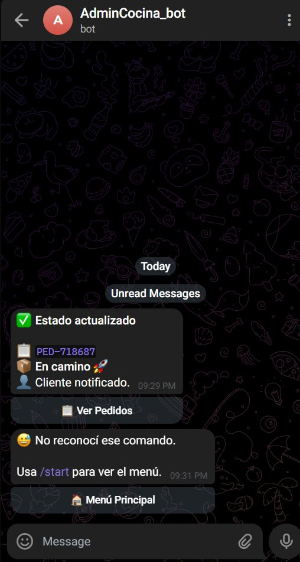 | 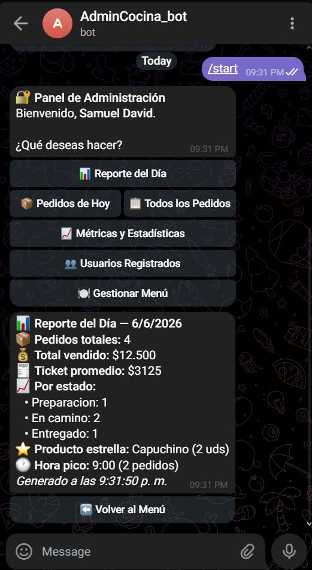 | 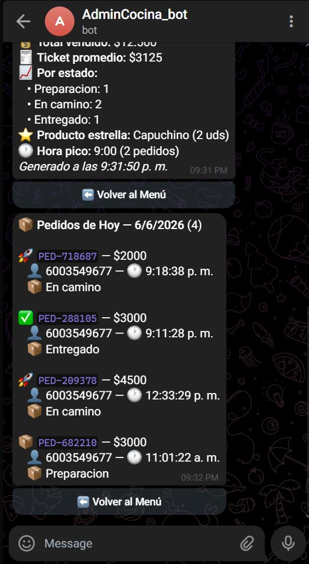 |

| Todos los Pedidos | Métricas | Usuarios + Menú |
|:-:|:-:|:-:|
| 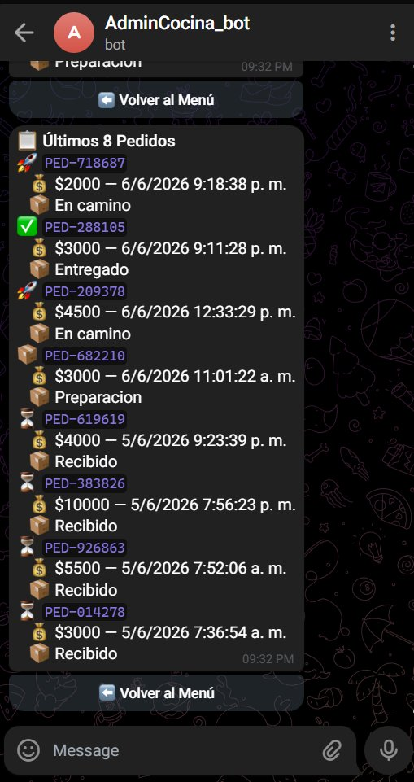 | 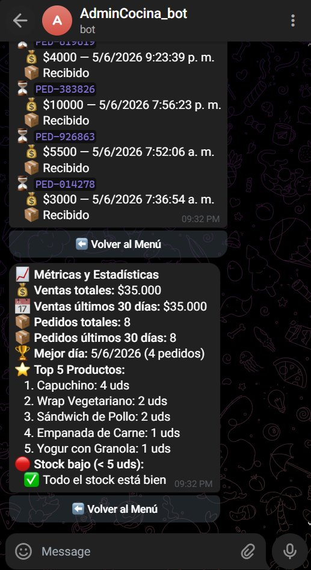 | 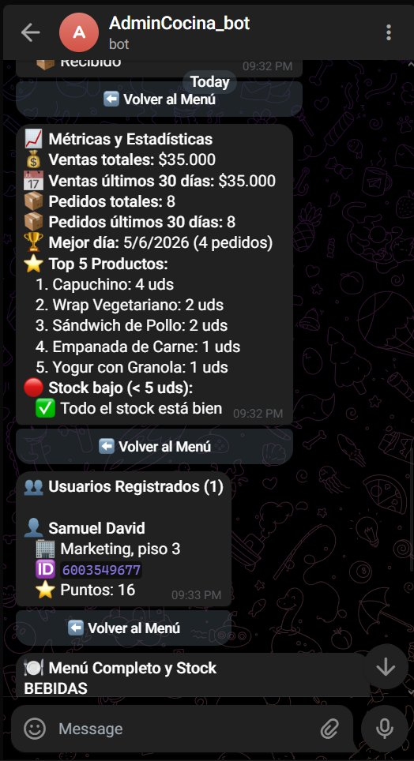 |

| Menú Completo con Stock |
|:-:|
| 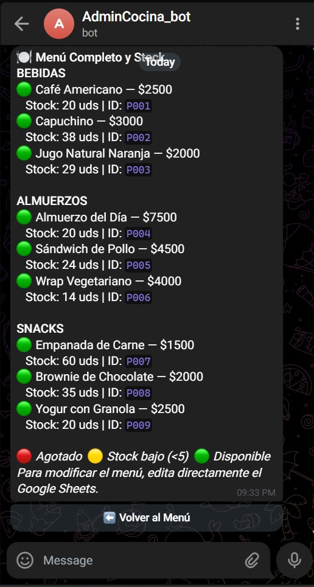 |

---

## 🗄️ Modelo de Datos (Google Sheets)

Base de datos: **DeliveryBot_DB** — [Ver Google Sheets](https://docs.google.com/spreadsheets/d/1BmoQ6RomVbNW-0NgIlpgvV_lynHmP1jeW5SOnNhIWtw/edit?gid=0#gid=0)

### Hoja: MENU
| Campo | Tipo | Descripción |
|---|---|---|
| `id_producto` | String | Identificador único (P001, P002...) |
| `nombre` | String | Nombre del producto |
| `descripcion` | String | Descripción breve |
| `precio` | Number | Precio en COP |
| `categoria` | String | Bebidas / Almuerzos / Snacks |
| `stock` | Number | Unidades disponibles |

### Hoja: PEDIDOS
| Campo | Tipo | Descripción |
|---|---|---|
| `id_pedido` | String | Número de orden único (PED-XXXXXX) |
| `id_usuario` | String | Telegram ID del cliente |
| `detalles_pedido` | String | Productos y cantidades (texto formateado) |
| `total_pago` | Number | Total en COP |
| `estado` | String | Recibido / Preparación / En camino / Entregado |
| `fecha` | String | Fecha en formato dd/mm/yyyy |
| `hora` | String | Hora de la orden |

### Hoja: USUARIOS
| Campo | Tipo | Descripción |
|---|---|---|
| `telegram_id` | String | ID único de Telegram |
| `nombre_completo` | String | Nombre del usuario |
| `departamento` | String | Departamento u oficina |
| `puntos_lealtad` | Number | Puntos acumulados (1 pto / $1.000) |

### Hoja: SESSIONS
| Campo | Tipo | Descripción |
|---|---|---|
| `telegram_id` | String | ID del usuario |
| `pantalla_actual` | String | Estado actual del wizard |
| `carrito_temporal` | String | Carrito en JSON |
| `ultimo_cambio` | String | Timestamp de la última acción |

---

## ⚙️ Flujos del Workflow

### Flujo 1 — Realizar Pedido (UserBot)
```
Telegram Trigger
  → Extract Fields
    → Leer Sesión
      → Router (pantalla actual)
        → [/start] Perfil Obtener → ¿Usuario Nuevo? → Bienvenida / Menú Principal
        → [menu] Mostrar Categorías → Filtrar Categoría → Mostrar Productos
        → [producto] Agregar al Carrito → Validar Stock (IF) → Guardar Carrito → Confirmación
        → [ver_carrito] Mostrar Carrito
        → [confirmar] Construir Pedido → Registrar Pedido → Actualizar Stock
                     → Calcular Nuevos Puntos → Actualizar Puntos Lealtad
                     → Confirmar al Usuario + Confirmar Puntos
                     → Notificar Cocina
```

### Flujo 2 — Gestión de Cocina (CocinaBot)
```
CocinaBot Trigger
  → Parsear Comando
    → Router Comandos
      → [ayuda] Enviar Ayuda
      → [pedidos] Leer Pedidos Activos → Mostrar Pedidos
      → [cambiar_estado] Validar Estado → Buscar Pedido → Actualizar Estado
                        → Notificar Cliente + Confirmar a Cocina
```

### Flujo 3 — Panel de Administración (AdminBot)
```
AdminBot Trigger
  → Parsear Entrada Admin
    → Router Admin
      → [reporte] Leer Pedidos → Generar Reporte → Enviar Reporte
      → [pedidos_hoy] Leer Pedidos → Filtrar Hoy → Mostrar
      → [historial] Leer Pedidos → Últimos 20 → Enviar Historial
      → [metricas] Leer Pedidos Métricas → Leer Menú Métricas → Calcular Métricas → Enviar
      → [usuarios] Leer Usuarios → Enviar Usuarios
      → [menu] Leer Menú → Formatear por Categoría → Enviar Menú Admin
```

### Flujo 4 — Reporte Automático Diario
```
Schedule Trigger (6:00pm, America/Bogota)
  → Leer Pedidos
    → Leer Admins
      → Generar Reporte (itera sobre todos los admins)
        → Enviar a Admin (uno por cada telegram_id en hoja ADMINS)
```

---

## 🚀 Instalación y Configuración

### Requisitos previos
- n8n instalado (Docker recomendado)
- Bot de Telegram creado con [@BotFather](https://t.me/BotFather) x3
- Cuenta de Google con acceso a Google Sheets
- ngrok o dominio con HTTPS para webhooks (si usas n8n local)

### Paso 1 — Clonar el repositorio
```bash
git clone https://github.com/samuelgelvez-star/Proyecto_DeliveryBot_GelvezRodriguezSamuelDavid.git
cd Proyecto_DeliveryBot_GelvezRodriguezSamuelDavid
```

### Paso 2 — Importar el workflow en n8n
1. Abre n8n en `http://localhost:5678`
2. Ve a **Workflows → Import from file**
3. Importa `DeliveryBot.json` (workflow principal)
4. Importa `ReporteDiario_DeliveryBot.json` (reporte automático separado)

### Paso 3 — Configurar credenciales
En n8n, crea las siguientes credenciales:

**Telegram:**
- Credencial 1 → Token de `@DeliveryBot_bot`
- Credencial 2 → Token de `@CocinaCafeteria_bot`
- Credencial 3 → Token de `@AdminCocina_bot`

**Google Sheets:**
- Conecta tu cuenta de Google con OAuth2
- Asegúrate de tener acceso al Google Sheets de la base de datos

### Paso 4 — Configurar Google Sheets
1. Abre el [Google Sheets de la base de datos](https://docs.google.com/spreadsheets/d/1BmoQ6RomVbNW-0NgIlpgvV_lynHmP1jeW5SOnNhIWtw/edit?gid=0#gid=0)
2. Verifica que existan las hojas: `MENU`, `PEDIDOS`, `USUARIOS`, `SESSIONS`, `ADMINS`
3. En la hoja `ADMINS`, agrega tu `telegram_id` y nombre para recibir el reporte diario
4. Carga los productos de prueba en la hoja `MENU`

### Paso 5 — Activar los workflows
1. Activa el workflow **DeliveryBot** en n8n
2. Activa el workflow **ReporteAutomatico – DeliveryBot**
3. Prueba enviando `/start` a cada bot en Telegram

---

## 📁 Estructura del Repositorio

```
Proyecto_DeliveryBot_GelvezRodriguezSamuelDavid/
│
├── DeliveryBot.json                  # Workflow principal (98 nodos)
├── ReporteDiario_DeliveryBot.json    # Workflow de reporte automático diario
├── README.md                         # Documentación técnica
│
└── screenshots/                      # Capturas de evidencia
    ├── workflow_n8n.png
    ├── menu_principal.png
    ├── categoria_bebidas.png
    ├── producto_agregado.png
    ├── carrito.png
    ├── pedido_confirmado.png
    ├── notificacion_estado.png
    ├── cocina_nuevo_pedido.png
    ├── cocina_cambio_estado.png
    ├── admin_panel.png
    ├── admin_reporte.png
    ├── admin_pedidos_hoy.png
    ├── admin_todos_pedidos.png
    ├── admin_metricas.png
    ├── admin_usuarios_menu.png
    └── admin_menu_stock.png
```

---

## ✅ Resultados Obtenidos

| Objetivo | Estado |
|---|---|
| Cero pérdida de pedidos — registro automático en la nube | ✅ Implementado |
| Pedidos anticipados — reducción de tiempos de espera | ✅ Implementado |
| Transparencia total — cliente sabe el estado de su pedido en tiempo real | ✅ Implementado |
| Reporte diario automático (total vendido, producto estrella, hora pico) | ✅ Implementado |
| Sistema de puntos de lealtad por consumo | ✅ Implementado |
| Validación de stock antes de confirmar pedido | ✅ Implementado |
| Panel de administración completo con métricas de 30 días | ✅ Implementado |

---

## 🛠️ Stack Tecnológico

| Tecnología | Uso |
|---|---|
| **n8n** | Motor de automatización y orquestación de flujos |
| **Telegram Bot API** | Interfaz conversacional (3 bots) |
| **Google Sheets** | Base de datos en la nube |
| **JavaScript (Code nodes)** | Lógica de negocio, cálculos y formateo de mensajes |
| **Docker** | Entorno de ejecución de n8n |
| **ngrok** | Túnel HTTPS para webhooks en desarrollo local |

---

## DeepWiki

**Tuve un problema y es que al momento de cambiar la palabra github por deepwiki en mi url de repositorio, le doy enter y me mandaba para la siguiente pagina:**

**No salia nada parecido a lo que nos mostro en la clase, asi que inicié sesion en deepwiki y ahi mismo le di create wiki, y le comparto el enlace por este medio: https://app.devin.ai/org/samuelgelvez-star/wiki/samuelgelvez-star/Proyecto_DeliveryBot_GelvezRodriguezSamuelDavid?branch=main.
Solo debe iniciar sesion para poder ver la wiki de mi repositorio.


##UPDATE EXAMEN NUMERO 1
#WORKFLOW ACTUALIZADO


#MENSAJE DE TELEGRAM


